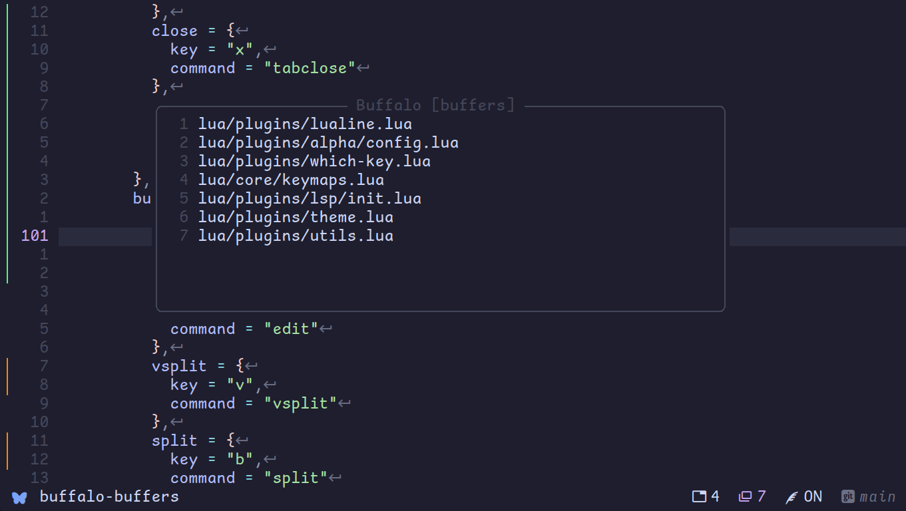
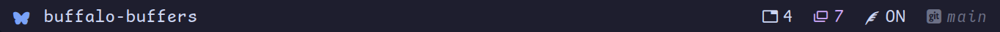

<h1 align="center">
 buffalo-nvim
</h1>

<p align="center">

</p>

This is a [harpoon](https://github.com/ThePrimeagen/harpoon) like plugin that provides an interface
to navigate through buffers or tabs.

> Their respective totals can be displayed on the statusline, tabline or winbar.

<p align="center">

</p>

<p align="center">

</p>

<hr />
<h3 align="center">
 statusline
</h3>

<p align="center">

</p>
<p align="right">
  <i>tabs: <strong>4 </strong> | buffers: <strong>7  </strong>[lualine]</i>
</p>

## Installation

Using [Lazy](https://github.com/folke/lazy.nvim)

```lua
  {
     'Pheon-Dev/buffalo-nvim'
  }
```

Using [packer.nvim](https://github.com/wbthomason/packer.nvim)

```lua
use 'Pheon-Dev/buffalo-nvim'
```

Using [vim-plug](https://github.com/junegunn/vim-plug)

```vim
Plug 'Pheon-Dev/buffalo-nvim'
```

## Setup

```lua
-- default config
require('buffalo').setup({})
```

## Usage

```lua
-- Keymaps
local opts = { noremap = true }
local map = vim.keymap.set
local buffalo = require("buffalo.ui")

-- buffers
map({ 't', 'n' }, '<C-Space>', buffalo.toggle_buf_menu, opts)

map('n', '<C-j>', buffalo.nav_buf_next, opts)
map('n', '<C-k>', buffalo.nav_buf_prev, opts)

-- tabpages
map({ 't', 'n' }, '<M-Space>', buffalo.toggle_tab_menu, opts)

map('n', '<C-n>', buffalo.nav_tab_next, opts)
map('n', '<C-p>', buffalo.nav_tab_prev, opts)

-- Example in lualine
...
sections = {
  ...
  lualine_x = {
      {
        function()
          local buffers = require("buffalo").buffers()
          local tabpages = require("buffalo").tabpages()
          return "󱂬 " .. buffers .. " 󰓩 " .. tabpages
        end,
        color = { fg = "#ffaa00", bg = "#24273a",},
      }
    },
  ...
    },
...
```

---

## Config

```lua
require("buffalo").setup({
  tab_commands = {  -- use default neovim commands for tabs e.g `tablast`, `tabnew` etc
    next = { -- you can use any unique name e.g `tabnext`, `tab_next`, `next`, `random` etc
      key = "<CR>",
      command = "tabnext"
    },
    close = {
      key = "c",
      command = "tabclose"
    },
    dd = {
      key = "dd",
      command = "tabclose"
    },
    new = {
      key = "n",
      command = "tabnew"
    }
  },
  buffer_commands = { -- use default neovim commands for buffers e.g `bd`, `edit`
    edit = {
      key = "<CR>",
      command = "edit"
    },
    vsplit = {
      key = "v",
      command = "vsplit"
    },
    split = {
      key = "h",
      command = "split"
    }
    buffer_delete = {
      key = "d",
      command = "bd"
    }
  },
  cycle = false, -- cycle through the list
  exit_menu = "x", -- similar to 'q' and '<esc>'
  borderchars = { "─", "│", "─", "│", "╭", "╮", "╯", "╰" },
  go_to = {
    enabled = true,
    go_to_tab = "<leader>%s",
    go_to_buffer = "<M-%s>",
  },
  filter = {
    enabled = true,
    filter_tabs = "<M-t>",
    filter_buffers = "<M-b>",
  },
})
```

---

## Tips

- Hit any number on the menu to navigate to that buffer or tab without having to scroll.
- Use normal keymap defaults for neovim e.g `dd` to delete a buffer, on the open menu.

---

## Highlights

- `BuffaloBorder`
- `BuffaloWindow`

---

## Acknowledgement

- ThePrimeagen's [Harpoon](https://github.com/ThePrimeagen/harpoon)
- J-Morano's [Buffer Manager](https://github.com/j-morano/buffer_manager.nvim)

---

## Contributions

- PRs and Issues are always welcome.
